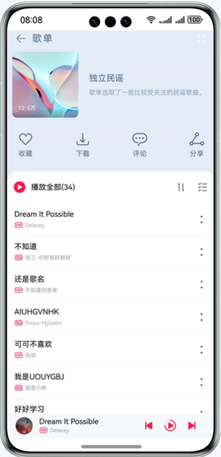
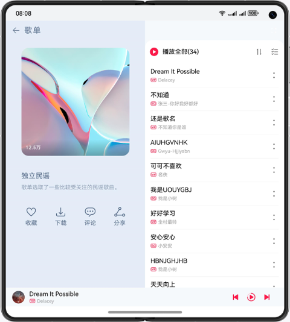
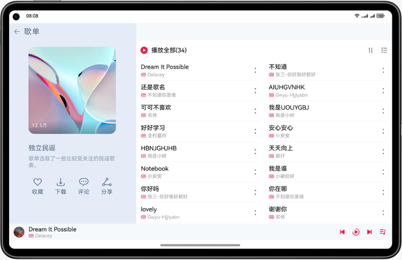
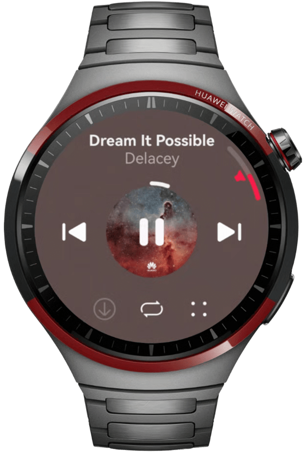

# 多设备音乐界面

## 项目简介

基于自适应和响应式布局，实现一次开发、多端部署音乐专辑。

手机效果图如下：



折叠屏效果图如下：



平板效果图如下：



智能穿戴效果图如下：



## 工程目录
```
├──commons                                    // 公共能力层
│  ├──constantsCommon/src/main/ets            // 公共常量
│  │  └──constants
│  └──mediaCommon/src/main/ets                // 公共媒体方法
│     └──utils
│     └──viewmodel
├──features                                   // 基础特性层
│  ├──live/src/main/ets                       // 直播页
│  │  ├──constants
│  │  ├──view
│  │  └──viewmodel
│  ├──live/src/main/resources                 // 资源文件目录
│  ├──musicComment/src/main/ets               // 音乐评论页
│  │  ├──constants
│  │  ├──view
│  │  └──viewmodel
│  ├──musicComment/src/main/resources         // 资源文件目录
│  ├──musicList/src/main/ets                  // 歌曲列表页
│  │  ├──components
│  │  ├──constants
│  │  ├──lyric
│  │  ├──view
│  │  └──viewmodel
│  └──musicList/src/main/resources            // 资源文件目录
├──products                                   // 产品定制层
│  ├──phone/src/main/ets                      // 支持手机、折叠屏、平板、PC/2in1
│  │  ├──common
│  │  ├──entryability
│  │  ├──pages
│  │  ├──phonebackupextability
│  │  └──viewmodel
│  ├──phone/src/main/ets                      // 资源文件目录
│  ├──watch/src/main/resources                // 支持智能穿戴
│  │  ├──constants                      
│  │  ├──pages
│  │  ├──view
│  │  ├──watchability
│  │  └──watchbackupability
│  └──watch/src/main/ets                      // 资源文件目录
```

## 使用说明

1. 分别在手机、折叠屏、平板、智能穿戴安装并打开应用，不同设备的应用页面通过响应式布局和自适应布局呈现不同的效果。
2. 点击界面上播放/暂停、上一首、下一首图标控制音乐播放功能。
3. 点击界面上播放控制区空白处或列表歌曲跳转到播放页面。
4. 点击界面上评论按钮跳转到对应的评论页面。
5. 其他按钮无实际点击事件或功能。

## 相关权限

不涉及

## 约束与限制

1. 本示例仅支持标准系统上运行，支持设备：华为手机、平板、PC/2in1、智能穿戴。
2. HarmonyOS系统：HarmonyOS 5.1.0 Release及以上。
3. DevEco Studio版本：DevEco Studio 5.1.0 Release及以上。
4. HarmonyOS SDK版本：HarmonyOS 5.1.0 Release SDK及以上。